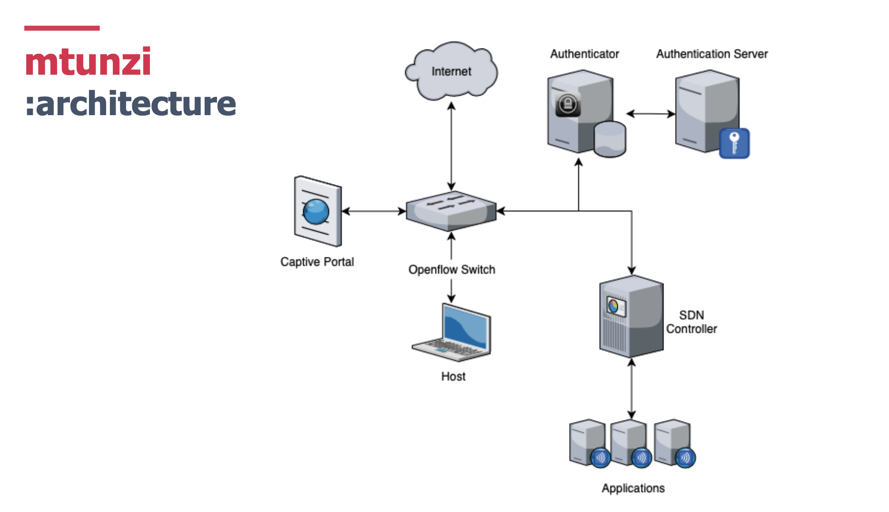

# **mtunzi**
## Software-defined network access control for small networks

### **What is *mtunzi?***
*Mtunzi* is a system for software-defined network access control and captive networking for low-resource settings. It is aimed toward the networking needs of small WISPs and community networking operators. With mtunzi we are simply trying to use a software-defined approach to 
1. registering and authenticating switches, 
2. authenticating hosts and users, and 
3. dynamically managing hosts and users. 

The goal is to design and develop a network access control and authorization mechanism for SDN networks. 



### **What are in here**
This repository includes `frontend` directory, which includes capport application and authentication setup. In the directory, you will find authenticator (i.e. the `authenticator` directory) and captive portal (i.e. the `capport` directory) codebase as well as the intructions to test the autentication process (i.e. `test.py` file).

The directory `mininet-setup` has the freeRADIUS server configuration files. The IP address of the client name *tester* under both `clients.conf` and `client.conf` needs to match with the local IP address of the local computer that runs the authenticator on. After the mentioned modification completets, all 3 files need to replace the files (under the same name) locate at 
```
~/etc/mininet/freeradius
```
on the virtual machine that runs the freeRADIUS on. Note that you will be required to be on the super user (i.e. using `sudo`) to make changes.

### **Bugs/shortcomings**

Due to the time constraint, the captive poral (i.e. the flask application) was not able to do the redirection based on the response back from the authenticator yet (i.e. the authenticaiton result whether or not user is authenticated). But the `test.py` will show the complete flow by logging 
```
Authenticated, you're good to go!
```
in the terminal.

### **Collaborators**

Innocent Ndubuisi-Obi Jr (@innoobijr) & Nussara ‘Firn’ Tieanklin (@nussarafirn)


